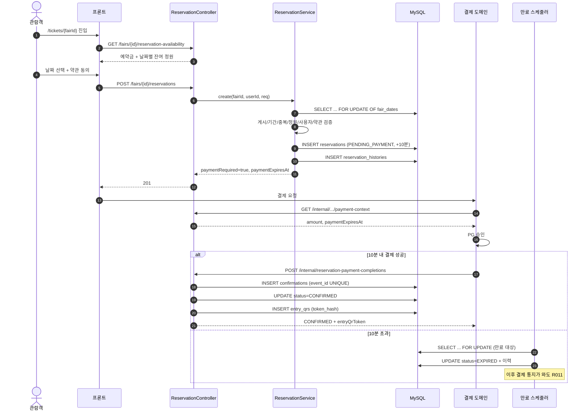
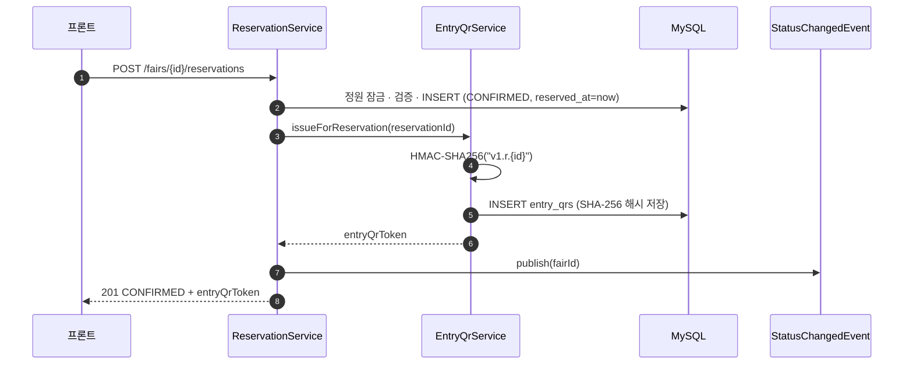
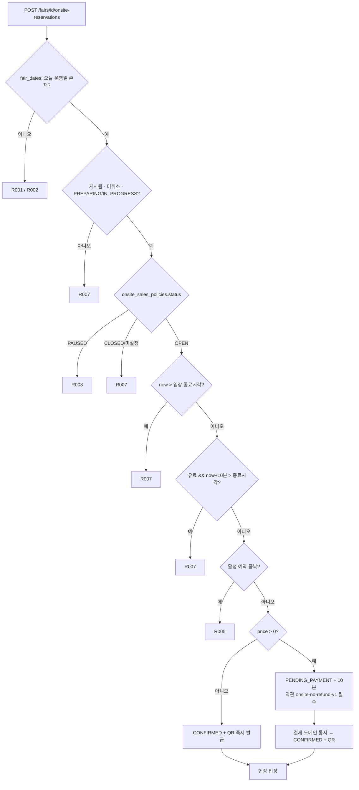
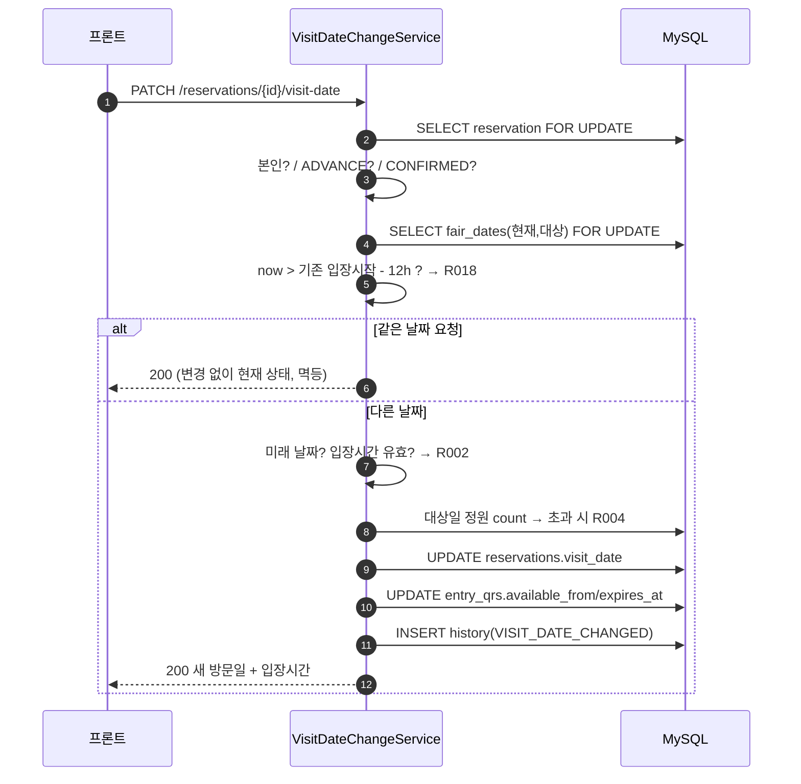
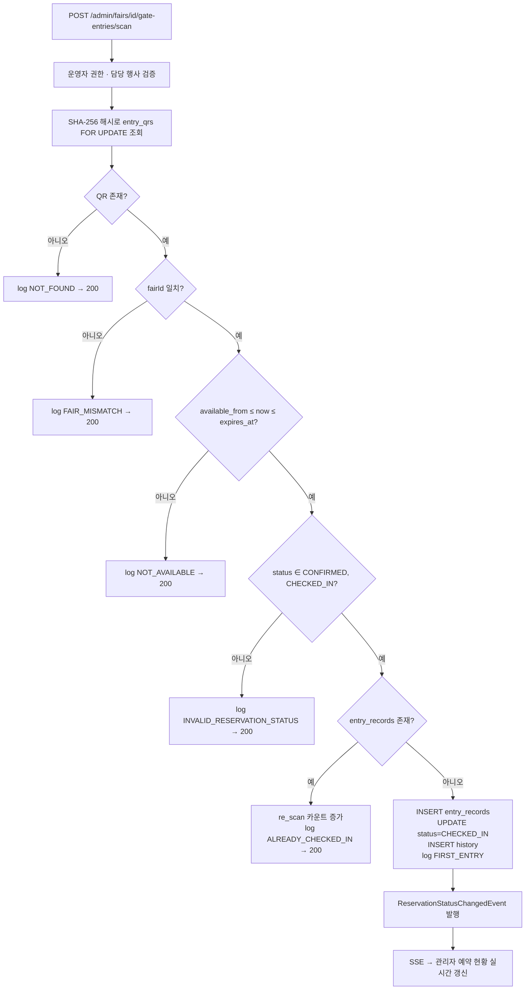
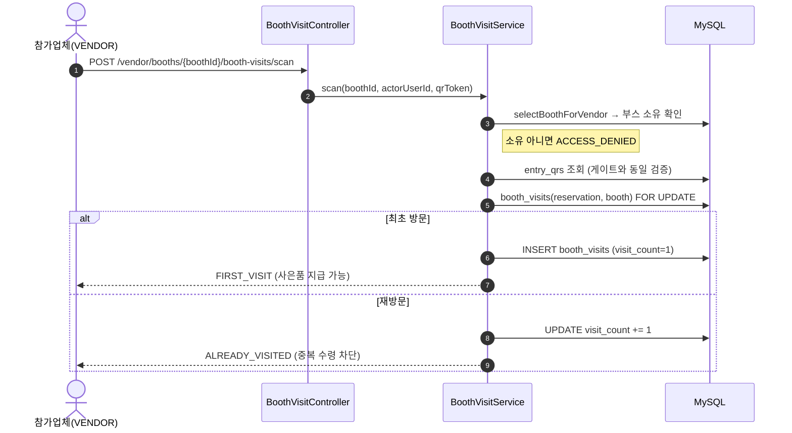
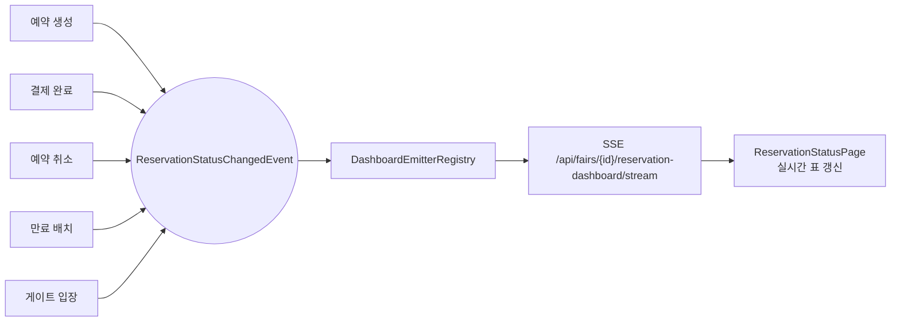

# 예약(Reservation) 기능 분석

> 대상: `src/main/java/com/ms/petopia/api/reservation/**`, `src/main/resources/mapper/reservation/**`,
> `frontend/src/pages/reservation/**`, `frontend/src/pages/fair-admin/**`
> 기준 커밋: `739b300` (dev, 2026-08-08) — 예약 단건 상세 조회 API 반영

---

## 1. 한눈에 보기

예약 도메인은 **"관람객이 행사 티켓을 잡고 → 결제하고 → QR로 입장하고 → 부스를 방문한다"**
는 흐름 전체를 담당한다. 결제 자체는 별도 결제 도메인이 소유하고, 예약 도메인은
**내부 계약 API 2개**(`/internal/api/v1/**`)로만 결제와 연결된다.

| 구성 | 개수 | 위치 |
|---|---|---|
| 컨트롤러 | 6 (+헬스체크) | `api/reservation/controller` |
| 서비스 | 20 | `api/reservation/service` |
| MyBatis 매퍼 | 9 | `api/reservation/mapper` + `resources/mapper/reservation` |
| DTO | 47 | `api/reservation/dto` |
| 프론트 페이지 | 5 | `pages/reservation` 3, `pages/fair-admin` 2 |

### 예약 유형 2가지

| 유형 | 값 | 특징 |
|---|---|---|
| 사전예약 | `ADVANCE` | 미래 운영일 선택, **정원(capacity) 차감**, 날짜 변경·취소 가능 |
| 현장 직접예매 | `ONSITE_DIRECT` | **당일만**, 정원 조회/차감 없음, 운영일별 `onsite_sales_policies`로 개폐 |

### 예약 상태 머신

```
                 ┌────────────── (무료: 즉시 확정) ──────────────┐
                 │                                              ▼
  [생성] ──유료──> PENDING_PAYMENT ──결제완료 통지──────────> CONFIRMED ──게이트 QR 스캔──> CHECKED_IN
                 │      │                                       │
                 │      │ 10분 경과 (스케줄러)                    │ 12시간 전까지 사용자 취소
                 │      ▼                                       ▼
                 │   EXPIRED                                 CANCELED
                 │      ▲                                       ▲
                 └──────┴────── 사용자 취소(결제 전) ─────────────┘
```

- 활성 상태 = `PENDING_PAYMENT` / `CONFIRMED` / `CHECKED_IN`
- DB 계산 컬럼 `active_key = user_id + '_' + fair_id` (활성일 때만 값) + `UK_RESERVATION_ACTIVE_USER_FAIR`
  → **한 사용자는 한 행사에 활성 예약 1건**이 DB 제약으로 강제된다.

---

## 2. API 전체 목록

### 2.1 관람객 API — `ReservationController` (`/api/v1`)

`SecurityConfig`에서 `/api/v1/reservations/**`, `/api/v1/fairs/*/reservations`,
`/api/v1/fairs/*/onsite-reservations` 는 `.authenticated()`. 사용자 식별은 JWT `@AuthenticationPrincipal Long userId`.

| # | Method | Path | 설명 |
|---|---|---|---|
| 1 | GET | `/fairs/{fairId}/reservation-availability` | 예약 가능 날짜·잔여 정원 조회 |
| 2 | GET | `/reservations/me` | 내 예약 목록(페이징) |
| 3 | GET | `/reservations/{reservationId}` | 예약 단건 상세 🆕 |
| 4 | POST | `/fairs/{fairId}/reservations` | 사전예약 생성 (201) |
| 5 | POST | `/fairs/{fairId}/onsite-reservations` | 현장 직접예매 생성 (201) |
| 6 | PATCH | `/reservations/{reservationId}/visit-date` | 방문일 변경 |
| 7 | PATCH | `/reservations/{reservationId}/cancel` | 예약 취소 |
| 8 | GET | `/reservations/{reservationId}/entry-qr` | 입장 QR 토큰 발급/조회 |

---

**① GET `/api/v1/fairs/{fairId}/reservation-availability`**

`ReservationAvailabilityService`

```jsonc
// 200
{
  "fairId": 1,
  "reservationFee": 5000,
  "dates": [
    { "visitDate": "2026-09-01", "entryStartTime": "10:00:00",
      "entryEndTime": "18:00:00", "remainingCapacity": 120, "available": true }
  ]
}
```

- 게시(`published_at`)·미취소·예약접수기간(`reservation_start_date ~ end_date`) 검증 → 실패 시 `R003`
- 날짜 목록은 `operation_date > today` 만 (당일은 사전예약 대상 아님)
- 잔여 = `capacity - (ADVANCE & 활성 상태 예약 수)`, 음수는 0으로 절삭

**② GET `/api/v1/reservations/me?page=0&size=20`**

`ReservationQueryService`. `size`는 최대 50 (`MAX_PAGE_SIZE`), 초과 시 `INVALID_INPUT_VALUE`.

```jsonc
{
  "items": [{
    "reservationId": 10, "fairName": "...", "fairPosterImageUrl": "...",
    "visitDate": "2026-09-01", "entryStartTime": "10:00:00", "entryEndTime": "18:00:00",
    "reservationStatus": "CONFIRMED",
    "isEnded": false,          // 입장 종료시각 경과 여부
    "qrAvailable": true,       // !isEnded && status ∈ {CONFIRMED, CHECKED_IN}
    "paymentAvailable": false, // PENDING_PAYMENT && now < paymentExpiresAt
    "amount": 5000, "reservedAt": "...", "checkedInAt": null
  }],
  "page": 0, "size": 20, "totalElements": 3, "totalPages": 1, "hasNext": false
}
```

> `isEnded` / `qrAvailable` / `paymentAvailable` 는 **서버가 계산해서 내려주는 화면 제어 플래그**다.
> 프론트는 이 값으로 버튼 노출을 결정하면 되고 시간 계산을 다시 할 필요가 없다.

**③ GET `/api/v1/reservations/{reservationId}`** — 예약 단건 상세 🆕 `a709465`

`ReservationQueryService.getReservationDetail`. 목록 필드에 **예약 유형과 케밥 메뉴 제어 플래그 2개**를 더한 응답이다.

```jsonc
{
  "reservationId": 10, "fairName": "...", "fairPosterImageUrl": "...",
  "visitDate": "2026-09-01", "entryStartTime": "10:00:00", "entryEndTime": "18:00:00",
  "reservationStatus": "CONFIRMED",
  "reservationType": "ADVANCE",   // 🆕 목록 응답에는 없는 필드
  "isEnded": false, "qrAvailable": true, "paymentAvailable": false,
  "amount": 0, "reservedAt": "...", "checkedInAt": null,
  "canChangeVisitDate": true,     // 🆕 케밥 "방문일 변경" 노출 여부
  "canCancel": true               // 🆕 케밥 "예약 취소" 노출 여부
}
```

- **본인 소유만.** 없거나 남의 예약이면 구분 없이 `R010`(404) — 존재 여부가 새어나가지 않는다
- 매퍼는 `selectReservationForOwner(reservationId, userId)` 로 **WHERE 절에서 소유자까지 걸러낸다**
  (조회 후 코드로 비교하지 않음)
- **QR 토큰은 상세 응답에 포함하지 않는다.** `qrAvailable` 플래그만 주고, 실제 발급은 `entry-qr` API 책임

플래그 계산 규칙:

| 플래그 | 조건 |
|---|---|
| `canChangeVisitDate` | `!isEnded && ADVANCE && CONFIRMED` |
| `canCancel` | `!isEnded && (PENDING_PAYMENT \|\| (ADVANCE && CONFIRMED && amount == 0))` |

> ⚠️ 이 두 플래그는 **상태·유형 기준의 대략적 판단**이다. **12시간 마감은 반영돼 있지 않다.**
> 실제 마감 검증은 변경/취소 API가 수행하며 초과 시 `R018`/`R019` 를 던진다.
> 즉 프론트는 이 플래그로 버튼을 그리되, **호출 실패(`R018`/`R019`)를 여전히 처리해야 한다.**

> 파생값(`isEnded` / `qrAvailable` / `paymentAvailable`) 계산은 `isEnded()` · `isPaymentAvailable()`
> 헬퍼로 추출돼 목록 조회와 공유된다. 두 API의 플래그가 어긋날 일이 없다.

**④ POST `/api/v1/fairs/{fairId}/reservations`** — 사전예약 생성

```jsonc
// Request
{ "visitDate": "2026-09-01", "reservationTermsAgreed": true, "reservationTermsVersion": "v1" }
// 201
{ "reservationId": 10, "reservationNo": "R20260901ABCDEFGHJKM",
  "reservationType": "ADVANCE", "reservationStatus": "PENDING_PAYMENT",
  "amount": 5000, "paymentRequired": true,
  "paymentExpiresAt": "2026-08-08T12:10:00", "entryQrToken": null }
```

검증 순서 (`ReservationService.create`):

1. `selectCreationContextForUpdate` — `fair_dates` 행만 `FOR UPDATE OF fd` 로 잠금
   (조인한 `fairs`까지 잠그면 같은 행사의 다른 운영일 예약이 전부 직렬화되므로 의도적으로 대상 한정)
2. 없으면 → 행사 존재 확인 후 `R001`(행사 없음) 또는 `R002`(날짜 불가)
3. 게시/취소/접수기간 → `R003`, `operation_date <= today` → `R002`
4. 활성 예약 중복 → `R005`
5. 정원 초과(`occupied >= capacity`) → `R004`
6. 사용자 스냅샷 검증: `status=ACTIVE` && `role=USER` 아니면 `ACCESS_DENIED`
7. 유료(`reservation_fee > 0`)면 약관 동의 필수 → 없으면 `R006`
8. INSERT. `DuplicateKeyException` 이 `UK_RESERVATION_ACTIVE_USER_FAIR` 위반이면 `R005`로 변환
9. 이력(`reservation_histories`) 기록
10. **무료면 그 자리에서 `CONFIRMED` + QR 발급**, 유료면 `PENDING_PAYMENT` + `now + 10분` 만료 설정
11. `ReservationStatusChangedEvent(fairId)` 발행 → 관리자 대시보드 SSE 갱신

**⑤ POST `/api/v1/fairs/{fairId}/onsite-reservations`** — 현장 직접예매

Body는 **선택**(`required = false`). 무료 현장예매는 바디 없이 호출 가능.

```jsonc
// Request (유료일 때만 필수)
{ "reservationTermsAgreed": true, "reservationTermsVersion": "onsite-no-refund-v1" }
// 201
{ "reservationId": 11, "reservationNo": "...", "reservationType": "ONSITE_DIRECT",
  "visitDate": "2026-08-08", "reservationStatus": "CONFIRMED",
  "amount": 0, "paymentRequired": false, "paymentExpiresAt": null,
  "entryQrToken": "v1.r.11.<HMAC>" }
```

사전예약과 다른 점:

- `visitDate` = **오늘 고정**, 정원 조회·차감 **없음**
- 행사 상태가 `PREPARING` 또는 `IN_PROGRESS` 여야 함 → 아니면 `R007`
- `onsite_sales_policies.status` 가 `OPEN` 이어야 함. `PAUSED` → `R008`, 그 외 → `R007`
- 입장 종료시각 경과 → `R007`
- 유료인데 **`now + 10분 > 입장 종료시각`** 이면 결제 대기 중 입장이 끝나므로 → `R007`
- 약관 버전은 `onsite-no-refund-v1` 로 고정 (환불 불가)

**⑥ PATCH `/api/v1/reservations/{id}/visit-date`**

```jsonc
// Request
{ "visitDate": "2026-09-03" }
// 200
{ "reservationId": 10, "previousVisitDate": "2026-09-01", "visitDate": "2026-09-03",
  "entryStartTime": "10:00:00", "entryEndTime": "18:00:00", "reservationStatus": "CONFIRMED" }
```

- 대상: **`ADVANCE` && `CONFIRMED`** 만 (아니면 `R013`)
- 본인 아니면 `ACCESS_DENIED`
- 현재/대상 운영일을 한 번에 `FOR UPDATE` 로 잠금
- **기존 방문일 입장 시작 12시간 전**까지만 가능 → 초과 시 `R018`
- 같은 날짜로 재요청하면 **변경 없이 현재 상태를 그대로 반환**(멱등)
- 대상 날짜: 미래여야 하고(`R002`), 정원 초과면 `R004`
- 변경 성공 시 **`entry_qrs`의 `available_from` / `expires_at` 도 같이 갱신** — QR을 재발급하지 않고 유효시간만 옮긴다

**⑦ PATCH `/api/v1/reservations/{id}/cancel`**

```jsonc
// Request (선택, reason 최대 500자)
{ "reason": "일정 변경" }
// 200
{ "reservationId": 10, "reservationStatus": "CANCELED", "canceledAt": "2026-08-08T12:00:00" }
```

취소 허용 규칙 (`validateCancelable`):

| 상태 | 결과 |
|---|---|
| `PENDING_PAYMENT` | **항상 허용** (결제 전이라 환불 없음) |
| `CONFIRMED` + `ADVANCE` + **금액 0** | 입장시작 `cancel_deadline_hours`(기본 12h) 전까지 허용, 초과 시 `R019` |
| `CONFIRMED` + 금액 > 0 | **현재 미지원 → `R013`** (TODO: 결제 도메인 환불 연동 후 개방) |
| `ONSITE_DIRECT` / `CHECKED_IN` / 그 외 | `R013` |

> ⚠️ 즉, **유료 예약은 결제가 끝나면 앱에서 취소할 수 없다.** 이건 미구현이 아니라 의도된 현재 상태이며
> `ReservationCancellationService:96` 에 TODO로 남아 있다.

**⑧ GET `/api/v1/reservations/{id}/entry-qr`**

```jsonc
{ "reservationId": 10, "qrToken": "v1.r.10.<base64url HMAC-SHA256>" }
```

- 본인 예약만 (`ACCESS_DENIED`)
- `CONFIRMED` / `CHECKED_IN` 만 (`R013`)
- 입장 종료시각 경과 → `R016`
- **토큰은 `reservationId`의 결정적 HMAC** 이므로 몇 번을 호출해도 같은 값 (멱등)
- DB(`entry_qrs`)에는 **원문이 아니라 SHA-256 해시만** 저장

### 2.2 게이트 입장 — `GateEntryController`

`POST /api/v1/admin/fairs/{fairId}/gate-entries/scan` — `hasAnyRole(EVENT_ADMIN, SUPER_ADMIN)`
+ 서비스에서 `ReservationOperatorAccessService.assertCanManageFair` 로 **담당 행사 배정까지** 재검증.

```jsonc
// Request
{ "qrToken": "v1.r.10....", "deviceInfo": "GATE-01 / iPad" }
// 200
{ "resultCode": "FIRST_ENTRY", "firstEntry": true,
  "entrySource": "ADVANCE", "firstCheckedInAt": "2026-09-01T10:12:00" }
```

| resultCode | 의미 |
|---|---|
| `FIRST_ENTRY` | 최초 입장 성공 → `entry_records` 생성 + 예약 `CHECKED_IN` |
| `ALREADY_CHECKED_IN` | 재스캔 → `entry_records.re_scan` 카운트만 증가 |
| `NOT_FOUND` | 해당 토큰 해시의 QR 없음 |
| `FAIR_MISMATCH` | 다른 행사 QR |
| `NOT_AVAILABLE` | 입장 가능 시간 밖 |
| `INVALID_RESERVATION_STATUS` | 예약이 취소/만료 등 |

> 설계 포인트: **실패도 예외가 아니라 결과 코드로 반환한다.** 예외를 던지면 트랜잭션이 롤백되어
> `gate_scan_logs` 감사 로그가 사라지기 때문. 모든 분기에서 스캔 로그를 남긴 뒤 코드로 응답한다.
> `deviceInfo` 는 200자로 잘라 저장한다.

### 2.3 부스 방문 — `BoothVisitController`

`POST /api/v1/vendor/booths/{boothId}/booth-visits/scan` — `hasRole(VENDOR)`
+ `selectBoothForVendor` 로 **해당 부스가 요청자 소유인지** 재확인 (아니면 `ACCESS_DENIED`).

```jsonc
{ "qrToken": "v1.r.10...." }
// 200
{ "resultCode": "FIRST_VISIT", "firstVisit": true, "visitCount": 1, "firstVisitedAt": "..." }
```

QR 검증 로직은 게이트와 동일. `(예약, 부스)` 조합의 최초 스캔만 방문 1건을 만들고
재스캔은 `visit_count` 만 증가시킨다 → **샘플·사은품 중복 수령 방지**가 목적.
resultCode: `FIRST_VISIT` / `ALREADY_VISITED` / `NOT_FOUND` / `FAIR_MISMATCH` / `NOT_AVAILABLE` / `INVALID_RESERVATION_STATUS`

### 2.4 현장예매 정책 관리 — `OnsiteSalesAdminController`

`/api/v1/admin/fairs/{fairId}/dates/{fairDateId}/onsite-sales-policy` — `EVENT_ADMIN` / `SUPER_ADMIN`

| Method | 설명 |
|---|---|
| GET | 정책 조회. 미설정이면 `price=0, status=CLOSED, version=0` 기본값 반환 |
| PUT | 가격·상태 저장 |

```jsonc
// PUT Request
{ "price": 10000, "status": "OPEN", "expectedVersion": 3 }
// 200
{ "fairId": 1, "fairDateId": 5, "operationDate": "2026-09-01",
  "price": 10000, "status": "OPEN", "version": 4, "updatedAt": "..." }
```

- `status` ∈ `OPEN` / `PAUSED` / `CLOSED`
- **낙관적 락**: `expectedVersion` 불일치 → `R009`.
  신규 생성 시엔 `expectedVersion`이 `null` 또는 `0` 이어야 하고, 기존 정책 수정 시엔 `null`이면 `R009`.
- `EVENT_ADMIN`은 `fair_admin_assignments` 에 배정된 행사만, `SUPER_ADMIN`은 전부

### 2.5 결제 도메인 내부 계약 — `ReservationPaymentContractController`

`/internal/api/v1/**`. 헤더 `X-Internal-Caller: PAYMENT` 필요(불일치 시 `ACCESS_DENIED`).
※ `SecurityConfig`에서는 `anyRequest().permitAll()` 에 걸리므로 **현재 보호는 이 헤더 검사뿐**이다
(`TODO 결제 도메인 연동 방식 확정 시 교체` 주석 존재).

**GET `/internal/api/v1/reservations/{id}/payment-context`**

결제 도메인이 "얼마를 언제까지 받으면 되는지" 예약 원장에서 확인하는 용도.

```jsonc
{ "reservationId": 10, "fairId": 1, "payerUserId": 7,
  "reservationType": "ADVANCE", "amount": 5000, "paymentExpiresAt": "..." }
```

`PENDING_PAYMENT` 아니면 `R013`(`EXPIRED`면 `R011`), 만료시각 경과 시 `R011`.

**POST `/internal/api/v1/reservation-payment-completions`**

```jsonc
// Request
{ "eventId": "evt-uuid", "paymentId": 900, "reservationId": 10,
  "paidAmount": 5000, "paidAt": "2026-08-08T12:05:00" }
// 200
{ "reservationId": 10, "reservationStatus": "CONFIRMED",
  "idempotentReplay": false, "entryQrToken": "v1.r.10...." }
```

멱등 처리가 이 API의 핵심이다.

1. `event_id` 로 기존 영수증 조회 → 있으면 필드 일치 확인 후 `idempotentReplay: true` 반환
2. `reservation_id` 로 영수증 조회 → 있으면 동일 처리
3. 금액 불일치 → `R012`, 만료 후 결제 → `R011`, 상태 불일치 → `R013`
4. `reservation_payment_confirmations` INSERT.
   `event_id`/`reservation_id`/`payment_id` 모두 UNIQUE 이므로 동시 통지·결제 재사용은 `R014`
5. `CONFIRMED` 전환 + 이력 + QR 발급 + 대시보드 이벤트 발행

> 이 서비스는 **결제 API를 호출하지도, 결제 테이블을 읽지도 않는다.** 결제 도메인이 검증한 결과를
> 통지로 받아 예약 상태에만 반영한다. `reservation_payment_confirmations` 는 결제 상세를 복제하지 않는
> 최소 영수증이다.

### 2.6 만료 스케줄러

`ReservationExpirationJob` — `@Scheduled(fixedDelay = ${petopia.reservation.expiration-check-interval-ms:60000})`,
배치 200건. `PENDING_PAYMENT` 이면서 `payment_expires_at` 이 지난 예약을 `EXPIRED` 로 전환하고
이력을 남긴 뒤, `fairId` 중복을 제거해 대시보드 이벤트를 발행한다.

### 2.7 관리자 대시보드 (statistics 도메인)

`ReservationDashboardController` (`/api/fairs`) — 예약 도메인이 발행한 `ReservationStatusChangedEvent`
를 구독해 SSE로 실시간 푸시한다.

| Method | Path |
|---|---|
| GET | `/api/fairs/{fairId}/reservation-dashboard?date=` |
| GET | `/api/fairs/{fairId}/qr-issuance-summary` |
| GET | `/api/fairs/{fairId}/hourly-entry-trend?date=` |
| GET | `/api/fairs/{fairId}/booth-visit-stats` |
| GET | `/api/fairs/{fairId}/booth-visit-pattern` |
| GET | `/api/fairs/{fairId}/reservation-dashboard/stream` (SSE, `text/event-stream`) |
| GET | `/api/fairs/{fairId}/visit-stats`, `/visit-stats/export` (xlsx) |

### 2.8 헬스체크 (임시)

`/api/reservation/health`, `/health/db`, `/health/redis`, `/health/logs`, `POST /health/echo`, `/health/error`.
로깅 필터·MyBatis·Redis 배선 확인용이며, 클래스 주석에 **"예약 도메인 구현이 끝나면 삭제하거나
actuator health로 대체"** 라고 명시돼 있다.

---

## 3. 에러 코드

| 코드 | HTTP | 메시지 |
|---|---|---|
| `R001` | 404 | 예약할 행사를 찾을 수 없습니다 |
| `R002` | 400 | 예약할 수 없는 방문 날짜입니다 |
| `R003` | 409 | 현재 예약을 접수하지 않는 행사입니다 |
| `R004` | 409 | 선택한 날짜의 예약이 마감되었습니다 |
| `R005` | 409 | 이미 활성 예약이 존재합니다 |
| `R006` | 400 | 유료 예약의 취소·환불 약관 동의가 필요합니다 |
| `R007` | 409 | 현재 현장예매를 접수하지 않습니다 |
| `R008` | 409 | 현장예매가 일시 중지되었습니다 |
| `R009` | 409 | 현장예매 정책이 다른 관리자에 의해 변경되었습니다 |
| `R010` | 404 | 예약을 찾을 수 없습니다 |
| `R011` | 409 | 예약의 결제 제한시간이 지났습니다 |
| `R012` | 409 | 예약금과 결제금액이 일치하지 않습니다 |
| `R013` | 409 | 현재 예약 상태에서는 요청을 처리할 수 없습니다 |
| `R014` | 409 | 이미 다른 결제로 확정된 예약이거나 중복된 결제 이벤트입니다 |
| `R015` | 404 | 유효한 입장 QR을 찾을 수 없습니다 |
| `R016` | 409 | 현재 사용할 수 없는 입장 QR입니다 |
| `R018` | 409 | 방문 날짜 변경 가능 시간이 지났습니다 |
| `R019` | 409 | 예약 취소 가능 시간이 지났습니다 |

---

## 4. 데이터 모델

| 테이블 | 역할 | 핵심 제약 |
|---|---|---|
| `reservations` | 예약 원장 | `UK_RESERVATION_NO`, `UK_RESERVATION_ACTIVE_USER_FAIR`(계산 컬럼 `active_key`), `CK_RESERVATION_TYPE` |
| `reservation_histories` | 상태 변경 감사 이력 | `actor_type` ∈ USER/ADMIN/SYSTEM/PAYMENT, `changed_by` NULL 허용(시스템·결제) |
| `reservation_pets` | 동반 반려동물 스냅샷 | **현재 예약 서비스 코드에서 미사용** |
| `entry_qrs` | 입장 QR | `UK_ENTRY_QR_TOKEN`(해시), `UK_ENTRY_QR_RESERVATION` → 예약당 1개. `qr_status`는 V4에서 폐기(NULL 허용) |
| `entry_records` | 입장 기록 | `entry_source` ∈ ADVANCE/ONSITE_DIRECT/KIOSK |
| `gate_scan_logs` | 게이트 스캔 감사 로그 | 실패 스캔도 전부 기록 |
| `booth_visits` | 부스 방문 | (예약, 부스) 최초 1건 + `visit_count` |
| `onsite_sales_policies` | 운영일별 현장예매 정책 | `UK_ONSITE_SALES_FAIR_DATE`, `version`(낙관적 락), `CK_..._STATUS` |
| `reservation_payment_confirmations` | 결제 성공 통지 영수증 | `event_id`/`reservation_id`/`payment_id` 각각 UNIQUE |

관련 마이그레이션: `V1__init.sql`, `V3__add_reservation_creation_constraints.sql`,
`V4__add_onsite_reservation_and_entry_flow.sql`

### 동시성 제어 요약

| 상황 | 방식 |
|---|---|
| 정원 초과 예약 | `fair_dates` 행만 `FOR UPDATE OF fd` 로 잠금 + 같은 트랜잭션에서 count → insert |
| 1인 1예약 | DB UNIQUE(`active_key`) + `DuplicateKeyException` → `R005` 변환 |
| QR 중복 발급 | 결정적 HMAC 토큰 + `UK_ENTRY_QR_RESERVATION` + 예외 시 재확인 |
| 결제 중복 통지 | 3중 UNIQUE + 사전 조회 멱등 반환 |
| 현장예매 정책 동시 수정 | `version` 낙관적 락 → `R009` |
| 만료 배치 | `selectDueReservationsForUpdate` 잠금 후 건별 조건부 UPDATE |

시간은 전부 `ReservationTimeProvider`(`Asia/Seoul`)를 통해 얻는다 — 테스트에서 시간을 갈아끼우기 위한 구조.

---

## 5. 프론트엔드 페이지

### 라우트

| 경로 | 페이지 | 대상 |
|---|---|---|
| `/tickets/:fairId` | `TicketReservationPage` | 관람객 — 예매 |
| `/reservations/me` | `MyReservationsPage` | 관람객 — 내 예약 목록 |
| `/reservations/me/:reservationId` | `ReservationDetailPage` | 관람객 — 예약 상세·QR·변경·취소 |
| `/fair-admin/reservations` | `ReservationStatusPage` | 관리자 — 실시간 예약 현황 |
| `/fair-admin/reservations/list` | `FairReservationsPage` | 관리자 — 예약 목록/필터 |

### 연동 상태 — ⚠️ 중요

| 페이지 | 데이터 소스 | 상태 |
|---|---|---|
| `ReservationStatusPage` | `api/statistics.ts` (실제 API + SSE) | ✅ **연동 완료** |
| `TicketReservationPage` | `mocks/reservationAvailability.ts` | ❌ 목업 |
| `MyReservationsPage` | `mocks/reservations.ts` | ❌ 목업 |
| `ReservationDetailPage` | `mocks/reservations.ts` | ❌ 목업 (변경·취소는 로컬 state만 변경) |
| `FairReservationsPage` | `mocks/adminReservations.ts` | ❌ 목업 |

`frontend/src/api/` 에 `reservation.ts` 가 **아직 없다.** 관람객 예약 API 7종은 서버에만 존재하고
프론트에서 호출되지 않는다. 각 페이지에 `// 백엔드 연동 전이라 mock 데이터를 그대로 그린다` 주석이 달려 있다.

**TicketReservationPage** — `form → payment → done` 3단계 로컬 상태 머신.
사전예약/현장예매 탭, 날짜 카드(잔여석·마감 표시), 유료 시 약관 체크박스, 결제위젯 자리(`토스 위젯 연동 예정`),
완료 화면의 QR은 `MOCK-QR-{fairId}-{visitDate}` 문자열로 그린다.

**ReservationDetailPage** — 케밥 메뉴 노출 규칙을 백엔드 정책 그대로 흉내낸다:
방문일 변경 = `ADVANCE && CONFIRMED && !isEnded`, 취소 = `!isEnded && (PENDING_PAYMENT || CONFIRMED)`.
※ 백엔드는 여기에 더해 **유료 확정 예약 취소 불가**와 **12시간 데드라인** 조건이 있으므로 연동 시 정합을 맞춰야 한다.

**상태 배지 색 규칙** (`AI_UI_RULES`, 목록·상세·관리자 3화면 공통):
빨강(`primary`)=결제 대기 / 초록(`leaf`)=확정·입장완료 / 회색(`neutral`)=취소·만료.

**ReservationStatusPage** — 유일하게 실제 연동된 화면.
`getReservationDashboard` + `getQrIssuanceSummary` 로 초기 로드 후
`subscribeReservationDashboard(fairId, cb)` (SSE)로 실시간 갱신, "실시간 연동 중" 뱃지 표시.
입장률 = `checkedIn / (confirmed + checkedIn)` — 결제대기·취소·만료는 분모에서 제외.
※ 담당 행사가 세션에 없어 **`fairId`를 수동 입력**하게 되어 있다(코드에 TODO 명시).

---

## 6. Flow

### 6.1 사전예약 — 유료 (전체 여정)



### 6.2 무료 예약 — 즉시 확정



### 6.3 현장 직접예매



정원 검사가 없다는 점이 사전예약과의 가장 큰 차이다.

### 6.4 방문일 변경



QR 토큰 값은 그대로 두고 **유효시간만 옮기는 것**이 핵심 — 사용자가 이미 저장한 QR이 계속 유효하다.

### 6.5 게이트 입장 스캔



모든 분기가 **200 + resultCode** 로 끝난다(= 스캔 로그 보존).

### 6.6 부스 방문 스캔



### 6.7 이벤트 → 실시간 대시보드



만료 배치는 한 번에 여러 건을 처리하므로 `fairId` 를 `Set` 으로 모아 **중복 제거 후** 발행한다.

---

## 7. 정리 — 현재 상태와 남은 일

**잘 잡혀 있는 부분**

- 정원·1인1예약·QR·결제통지·정책수정 각각에 맞는 동시성 제어가 층층이 걸려 있다(비관적 락 / DB UNIQUE / 낙관적 락).
- QR은 원문 미저장(해시만) + HMAC 결정적 토큰이라 재발급 없이 멱등하다.
- 스캔 실패를 예외가 아닌 결과 코드로 반환해 감사 로그를 반드시 남긴다.
- 결제 도메인과 데이터·트랜잭션을 공유하지 않고 통지 계약으로만 결합돼 있다.
- 화면 제어 플래그(`qrAvailable`, `paymentAvailable`, `isEnded`, `canCancel`, `canChangeVisitDate`)를
  서버가 계산해 내려주고, 계산 헬퍼를 목록·상세가 공유해 두 API가 어긋나지 않는다.

**코드에 TODO로 남아 있는 미완 지점**

1. **유료 확정 예약 취소 불가** — 결제 도메인 환불 연동 대기 (`ReservationCancellationService`)
2. **내부 계약 API 인증이 `X-Internal-Caller` 헤더 문자열 비교뿐** — Security 설정상 `permitAll` 구간
   (`ReservationPaymentContractController`)
3. **관람객 예약 화면 5개 중 4개가 목업** — `frontend/src/api/reservation.ts` 부재.
   백엔드 API는 8종이 모두 준비된 상태라, 남은 건 프론트 연동뿐이다.
4. **관리자 예약 현황의 `fairId` 수동 입력** — 관리자 세션에 담당 행사 연결 필요
5. **`reservation_pets` 테이블 미사용** — 동반 반려동물 등록 플로우 없음
6. `HealthCheckController` 제거 또는 actuator 대체 예정

---

## 8. 화면 기준 갭 분석 — 만들어지지 않은 부분

백엔드 API를 기준이 아니라 **사용자가 실제로 밟는 화면 동선**을 기준으로 훑었을 때 비어 있는 곳이다.

### 8.1 🔴 치명적 — 예매 화면에 들어갈 진입점이 없다

`TicketReservationPage`(`/tickets/:fairId`)는 구현돼 있지만, **여기로 이동하는 링크가 코드 전체에 하나도 없다.**

| 진입점 | 이동 경로 | 실제 도착 화면 |
|---|---|---|
| 홈 Hero "티켓 예매하기" 버튼 | `/tickets` | ❌ `PlaceholderPage` |
| 홈 QuickMenu "티켓 예매" 카드 | `/tickets` | ❌ `PlaceholderPage` |
| GNB `티켓 예매 > 예매 가능한 행사` | `/tickets` | ❌ `PlaceholderPage` |
| 내 예약 목록 빈 상태 "티켓 예매하러 가기" | `/tickets` | ❌ `PlaceholderPage` |
| 예매 완료 화면 "다른 행사 보기" | `/tickets` | ❌ `PlaceholderPage` |

→ **`/tickets` (예매 가능한 행사 목록) 화면이 없어서, 예매 화면은 URL을 직접 쳐야만 도달한다.**
관람객 예약 동선의 첫 단추가 통째로 비어 있는 상태다.

```
[현재]  홈 ──"티켓 예매"──> /tickets (빈 화면) ─╳─ 끊김
                                                  ⋮  (링크 없음)
                                                  ▼
                                          /tickets/:fairId (구현됨, 도달 불가)

[필요]  홈 ──> /tickets 행사 목록 ──카드 클릭──> /tickets/:fairId 예매
```

또한 `/fairs/upcoming`, `/fairs/past` 도 Placeholder라 **행사 상세 → 예매** 경로도 없다.

### 8.2 🔴 결제 대기 예약을 이어서 결제하는 화면이 없다

백엔드는 유료 예약을 `PENDING_PAYMENT` + 10분 만료로 만들고,
`/reservations/me` 응답에 **`paymentAvailable`(결제 계속 가능 여부)** 플래그까지 계산해 내려준다.
`mocks/reservations.ts` 타입에도 `/** 결제 대기 예약에서 "결제 계속하기"를 보여줄지 */` 로 주석까지 달려 있다.

그런데 **`paymentAvailable` 을 읽는 화면이 한 곳도 없다.**

- `MyReservationsPage`: 상태 배지만 표시, 버튼 없음
- `ReservationDetailPage`: 결제 관련 UI 없음
- `TicketReservationPage`: 결제 단계가 있지만 **예매 흐름 안에서만** 접근 가능. 이탈 후 복귀 불가

→ 결제 중 이탈한 사용자는 10분 안에 결제를 재개할 방법이 없고, 그대로 `EXPIRED` 된다.
또한 예매 화면의 결제 단계는 `결제위젯 자리 (연동 예정)` 플레이스홀더이고,
버튼을 누르면 서버 호출 없이 `setPhase("done")` 으로 넘어간다.

### 8.3 🟠 QR 입장 스캔 화면이 없다 (게이트 운영)

`config/navigation.ts` 에 **`{ label: "QR 입장 스캔", path: "/fair-admin/qr" }` 메뉴가 이미 노출되고 있지만**,
`AppRouter`에 라우트가 없어 `AdminFallback` → `PlaceholderPage` 로 떨어진다.

즉 `POST /api/v1/admin/fairs/{fairId}/gate-entries/scan` 은 **호출할 화면이 없다.**
현장 입장 처리는 백엔드만 완성돼 있고 운영자가 쓸 수단이 없는 상태다.

필요한 것: 카메라/스캐너 입력 → 스캔 → `resultCode` 6종별 피드백
(`FIRST_ENTRY` 통과 / `ALREADY_CHECKED_IN` 재입장 경고 / `NOT_FOUND`·`FAIR_MISMATCH`·`NOT_AVAILABLE`·`INVALID_RESERVATION_STATUS` 거부)

### 8.4 🟠 참가업체 부스 스캔 화면이 없다

`POST /api/v1/vendor/booths/{boothId}/booth-visits/scan` 도 마찬가지다.
`/booths/me`(내 부스 관리)는 `publicPages` Placeholder 목록에 있고, VENDOR 전용 레이아웃·라우트 자체가 없다.

`FIRST_VISIT` / `ALREADY_VISITED` 구분은 **사은품 중복 수령 차단**이 목적이라 현장에서 바로 필요한 화면인데,
스캔 UI가 없어 기능이 동작하지 않는다.

### 8.5 🟠 현장예매 정책 설정 화면이 없다

`GET/PUT /api/v1/admin/fairs/{fairId}/dates/{fairDateId}/onsite-sales-policy` 를 호출하는 화면이 없다.

`FairDateManagementPage` 는 `onsiteSalesConfigured` 를 **"설정됨 / -" 읽기 전용 표시**로만 쓴다
(운영일 삭제 전 경고용). 가격 입력·`OPEN`/`PAUSED`/`CLOSED` 전환·`expectedVersion` 낙관적 락 처리 UI가 전부 없다.

→ 정책이 `OPEN` 이 되지 않으면 **현장 직접예매는 항상 `R007`로 거부된다.**
즉 현장예매 기능 전체가 화면 부재로 인해 실사용 불가 상태다.

### 8.6 ✅ 예약 단건 조회 API — 해결됨 (`a709465`), 단 `reservationNo` 하나 남음

`GET /api/v1/reservations/{reservationId}` 가 신설되어 이 갭은 대부분 닫혔다.

| `ReservationDetailPage` 표시 항목 | 이전 (`/reservations/me`) | 현재 (단건 상세) |
|---|---|---|
| 방문일 / 입장시간 / 금액 / 상태 | ✅ | ✅ |
| 예약 확정시각 / 최초 입장시각 | ✅ | ✅ |
| 예약 유형 `reservationType` | ❌ 없음 | ✅ **추가됨** |
| 케밥 노출 조건 | 화면이 직접 판단 | ✅ **`canChangeVisitDate`·`canCancel` 서버 제공** |
| 예약번호 `reservationNo` | ❌ 없음 | ❌ **여전히 없음** |

**남은 것 하나** — 상세 화면은 `<DetailRow label="예약번호" value={reservation.reservationNo} />` 로
예약번호를 표시하는데, `ReservationDetailResponse` 에 이 필드가 없다.
DB `reservations.reservation_no` 에는 값이 있고 생성 API 응답에도 포함되므로,
`ReservationDetailResponse` 와 `selectReservationForOwner` 쿼리에 **한 필드만 추가**하면 된다.
(추가하지 않을 거라면 상세 화면에서 예약번호 행을 빼야 한다.)

> 부수 효과로 딥링크·새로고침 문제도 함께 해결됐다. 이전에는 상세 화면이 목록에서 `find` 로
> 찾는 구조라 페이징 뒤쪽 예약은 URL 직접 진입이 불가능했다.

### 8.7 🟡 방문일 변경 UI가 자유 입력이다

`ReservationDetailPage` 의 변경 다이얼로그는 `<Input type="date" />` 로 **아무 날짜나** 고를 수 있다.
실제 백엔드는:

- 해당 행사에 등록된 **운영일(`fair_dates`)** 중에서만 가능 → 아니면 `R002`
- 대상일 **잔여 정원**이 있어야 함 → 없으면 `R004`
- 기존 방문일 입장 시작 **12시간 전**까지만 → 초과 시 `R018`

→ 변경 다이얼로그에서 `reservation-availability` 를 다시 조회해
**선택 가능한 운영일 카드 + 잔여석**을 보여주는 방식으로 바꿔야 한다(예매 화면의 날짜 선택 UI 재사용).

### 8.8 🟡 취소·변경 조건 — 서버가 플래그를 주기 시작했고, 화면만 따라가면 된다

`a709465` 로 서버가 `canCancel` / `canChangeVisitDate` 를 계산해 내려주면서
**프론트가 조건을 직접 판단할 이유가 없어졌다.**

| | 프론트 현재 조건 (자체 판단) | 서버 `canCancel` |
|---|---|---|
| 취소 | `!isEnded && (PENDING_PAYMENT \|\| CONFIRMED)` | `!isEnded && (PENDING_PAYMENT \|\| (ADVANCE && CONFIRMED && amount == 0))` |

→ 유료 확정 예약에 취소 버튼이 뜨는 문제는 **화면이 서버 플래그를 쓰도록 바꾸기만 하면** 사라진다.
`ReservationDetailPage` 의 `canChangeDate` / `canCancel` 지역 변수를 응답 필드로 교체하는 작업이다.

> `c341086`(코드래빗 피드백)에서 **종료된 예약은 `PENDING_PAYMENT` 여도 `canCancel = false`** 로
> 수정됐다. 두 플래그 모두 `!isEnded` 를 전제로 한다.

**다만 12시간 마감은 플래그에 없다.** 서버 주석에도 "대략적 판단이며 실제 마감 검증은 각 API가 한다"고
명시돼 있다. 따라서 화면은 플래그로 버튼을 그리되 **`R018`/`R019` 응답을 반드시 처리**해야 한다
— 버튼을 눌렀는데 마감이 지난 경우다.

### 8.9 🟡 QR 화면이 아직 실제 토큰을 쓰지 않는다

`ReservationDetailPage` / `TicketReservationPage` 모두 `QrCanvas` 컴포넌트는 붙어 있으나
값이 `MOCK-QR-{reservationId}` 문자열이다. `GET /reservations/{id}/entry-qr` 호출이 없다.
QR 만료(`R016`) 시 처리, 화면 밝기 안내는 있으나 **토큰 갱신·만료 표시 로직은 없다.**

### 8.10 갭 요약표

| # | 빠진 것 | 대응 API | 심각도 |
|---|---|---|---|
| 1 | `/tickets` 예매 가능 행사 목록 (예매 진입점) | fair 도메인 | 🔴 동선 단절 |
| 2 | 결제 이어하기 화면 + 실제 결제위젯 | `paymentAvailable`, 결제 도메인 | 🔴 결제 이탈 복구 불가 |
| 3 | `/fair-admin/qr` 게이트 입장 스캔 | `POST .../gate-entries/scan` | 🟠 메뉴만 존재 |
| 4 | 참가업체 부스 스캔 | `POST .../booth-visits/scan` | 🟠 화면 전무 |
| 5 | 현장예매 정책 설정 | `GET/PUT .../onsite-sales-policy` | 🟠 현장예매 사용 불가 |
| ~~6~~ | ~~예약 단건 조회~~ | ~~API 자체 없음~~ | ✅ **`a709465` 해결** |
| 6' | 상세 응답에 `reservationNo` 누락 | `GET /reservations/{id}` | 🟡 필드 1개 추가 |
| 7 | 방문일 변경 시 운영일·잔여석 선택 | `reservation-availability` | 🟡 실패 유발 |
| 8 | 취소·변경 조건을 서버 플래그로 교체 | `canCancel`·`canChangeVisitDate` | 🟡 화면만 수정 |
| 9 | 실제 QR 토큰 연동 | `GET .../entry-qr` | 🟡 목업 |
| 10 | 행사 상세 → 예매 경로 | fair 도메인 | 🟡 동선 보강 |

### 8.11 완성 순서

> 진입점(`/tickets` 목록)은 **행사 도메인이 담당**하므로 이 순서에서 제외한다.

**API 모듈은 미리 다 쓰지 않는다.** `frontend/src/api/reservation.ts` 파일 하나를 유지하되,
각 단계에서 **그 화면이 실제로 쓰는 함수만 append** 한다. 미리 8개를 다 써두면 뒤쪽 스캔 API는
몇 주간 아무도 호출하지 않는 상태로 남고, 그 사이 백엔드가 바뀌어도 조용히 틀린 채 방치된다.

| 단계 | 화면 작업 | `api/reservation.ts` 에 추가할 함수 | 상태 |
|---|---|---|---|
| ~~0~~ | ~~예약 단건 조회 API 신설~~ | — | ✅ **완료** (`a709465`) |
| 0' | 상세 응답에 `reservationNo` 추가 (DTO + 쿼리 1줄씩) | — (백엔드) | 남음 |
| 1 | **내 예약 목록·상세·QR** 연동 (읽기)<br/>인증 배선 검증 | 공통 타입 + `getMyReservations`<br/>`getReservationDetail`, `getEntryQr` | 남음 |
| 2 | **예매 화면** — 사전예약 무료 경로<br/>→ **첫 완결 동선** | `getReservationAvailability`<br/>`createAdvanceReservation` | 남음 |
| 3 | **변경·취소** (서버 플래그로 교체 + `R018`/`R019` 처리)<br/>변경 다이얼로그에 날짜 선택 UI 재사용 | `changeVisitDate`, `cancelReservation`<br/>(`getReservationAvailability` 재사용) | 남음 |
| 4 | **현장예매 정책 관리** 화면 (관리자)<br/>— 5번의 전제조건 | `getOnsiteSalesPolicy`<br/>`saveOnsiteSalesPolicy` | 남음 |
| 5 | **현장예매** 생성 연동 | `createOnsiteReservation` | 남음 |
| 6 | **게이트 QR 스캔** 화면 (`/fair-admin/qr` 라우트 신설) | `scanGateEntry` | 남음 |
| 7 | **부스 스캔** (VENDOR 레이아웃 신설 필요) | `scanBoothVisit` | 남음 |

1단계 상단에 공통 타입을 한 번만 정의하고 이후 재사용한다 — 단계마다 다시 선언하지 않기 위함이다.

```ts
export type ReservationStatus =
  | "PENDING_PAYMENT" | "CONFIRMED" | "CHECKED_IN" | "CANCELED" | "EXPIRED";
export type ReservationType = "ADVANCE" | "ONSITE_DIRECT";
```

**순서 근거**

- **0' 을 먼저** — 프론트 타입이 여기 물려 있어 나중에 하면 같은 타입을 두 번 고친다
- **1 을 2보다 먼저** — 읽기 전용이라 안전하고, JWT 인증 배선이 실제로 도는지 여기서 처음 검증된다
- **2 에서 무료만** — 무료는 서버가 한 트랜잭션에서 `CONFIRMED` + QR까지 끝내므로 결제 도메인 없이 완결된다
- **4 를 5보다 먼저** — 정책이 `OPEN` 이 아니면 현장예매는 무조건 `R007`, 즉 테스트 자체가 불가능하다
- **6 을 뒤로** — 1~5가 실제 QR을 발급해야 스캔할 대상이 생긴다
- **7 이 마지막** — VENDOR 전용 레이아웃·라우트가 통째로 없어 예약 도메인 밖 작업이 가장 많이 딸려온다

**파일 분리 판단은 4단계에서**

4·6·7단계 함수는 관람객이 아니라 관리자(`/api/v1/admin/**`)·참가업체(`/api/v1/vendor/**`) API다.
기존 `api/fair.ts` 가 공개·관리자 API를 한 파일에 두고 있으므로 그 관례를 따르면 `reservation.ts`
하나로 충분하다. 다만 8개가 다 차면 300줄에 가까워지므로, **4단계 시점에 `reservationAdmin.ts`
분리 여부를 판단**한다. 지금 미리 나눌 필요는 없다.

**이 순서에서 제외한 것**

- **유료 확정 예약 취소** — 결제 도메인 환불 연동이 선행돼야 열린다 (`ReservationCancellationService` TODO)
- **결제 이어하기 / 결제위젯** — 결제 도메인 진척에 종속. 3단계 이후 아무 때나 붙일 수 있다
  (`paymentAvailable` 플래그는 1단계부터 이미 응답에 들어온다)
- **`reservation_pets` 동반 반려동물** — 테이블만 있고 API·기획 모두 없어 새 설계가 필요하다
